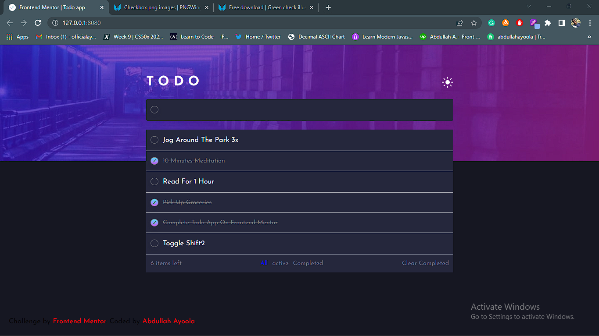
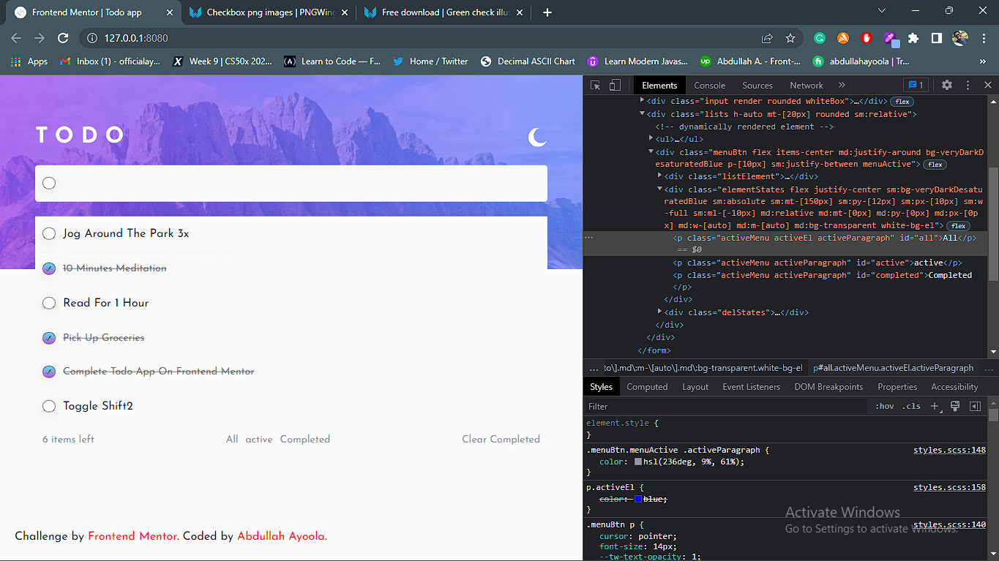
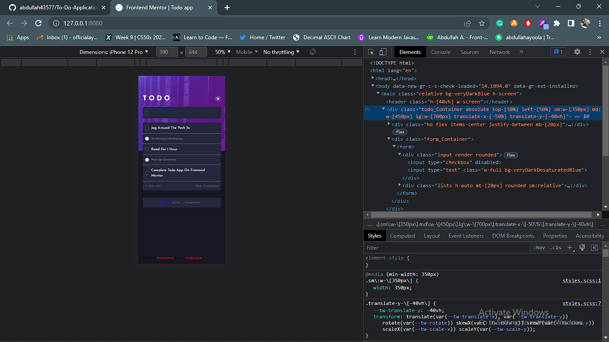
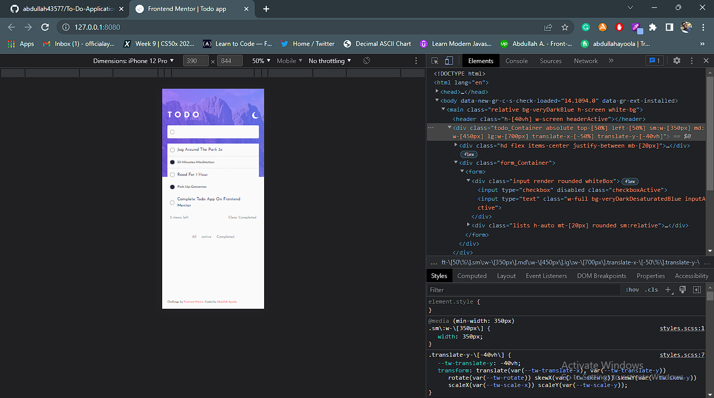

# Frontend Mentor - Todo app solution

This is a solution to the [Todo app challenge on Frontend Mentor](https://www.frontendmentor.io/challenges/todo-app-Su1_KokOW). Frontend Mentor challenges help you improve your coding skills by building realistic projects.

## Table of contents

- [Overview](#overview)
  - [The challenge](#the-challenge)
  - [Screenshot](#screenshot)
  - [Links](#links)
- [My process](#my-process)
  - [Built with](#built-with)
  - [Useful resources](#useful-resources)
- [Author](#author)

## Overview

### The challenge

Users should be able to:

- View the optimal layout for the app depending on their device's screen size
- See hover states for all interactive elements on the page
- Add new todos to the list
- Mark todos as complete
- Delete todos from the list
- Filter by all/active/complete todos
- Clear all completed todos
- Toggle light and dark mode
- **Bonus**: Drag and drop to reorder items on the list

### Screenshot

### Links

- Solution URL: [Solution URL here](https://www.frontendmentor.io/solutions/todo-app--7xpuek8KH)
- Live Site URL: [Live site URL here](https://todoapplicationz.netlify.app/)

## My process

### Built with

- Semantic HTML5 markup
- SCSS / Sass
- Flexbox
- Desktop-first workflow
- [Tailwind Utility Components](https://tailwindcss.com/) - For styles

### Useful resources

- [Tailwind Utility Components](https://tailwindcss.com/) - This helped me with the styling of the page much faster and easier.

## Author

- Website - [Abdullah Ayoola](https://github.com/abdullah43577)
- Frontend Mentor - [@abdullah43577](https://www.frontendmentor.io/profile/abdullah43577)
- Twitter - [@officialayo540](https://twitter.com/officialayo540)
